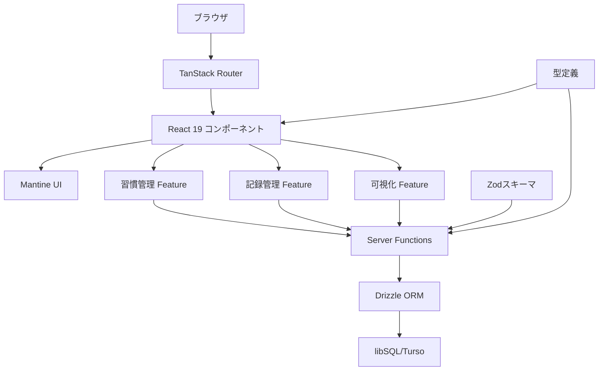
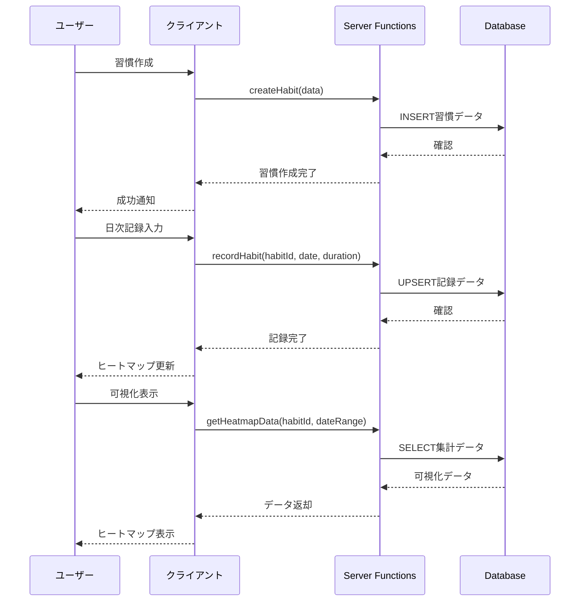
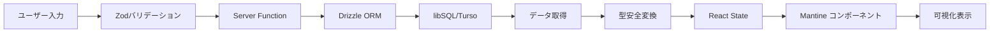

# 技術設計ドキュメント

## 概要

習慣追跡システムは、TanStack Startをベースとしたフルスタック React アプリケーションとして実装されます。ユーザーが日々の習慣実行を記録し、ヒートマップとカレンダーによる可視化を通じて習慣形成をサポートします。このシステムは、既存のTanStack Start + React 19技術スタックを活用し、Mantine UIコンポーネントとlibSQL/Tursoデータベースを統合して構築されます。

### 目標
- 日次習慣記録の直感的なインターフェース提供
- リアルタイムデータ可視化による継続モチベーション向上
- 型安全で保守性の高いコードベース構築
- 3秒以内の初期ページロード達成

### 非目標
- マルチユーザー機能（将来の拡張予定）
- モバイルアプリ対応（現段階ではレスポンシブWebのみ）
- ソーシャル機能やデータ共有
- 複雑な分析・レポート機能

## アーキテクチャ

### 既存アーキテクチャ分析
現在のTanStack Startプロジェクトは以下の構造を採用：
- ファイルベースルーティング（`src/routes/`）
- Server Functions によるサーバーサイド処理
- Drizzle ORM + libSQL データベース統合
- Mantine UI コンポーネントライブラリ

習慣追跡システムは、この既存パターンを尊重し拡張します：
- 既存の`features/`ディレクトリ構造を活用
- 確立されたServer Functions パターンを継承
- 統一されたMantine UI テーマ設定を維持

### 高レベルアーキテクチャ



### 技術スタック決定と根拠

#### アーキテクチャパターン選択
**決定**: 機能ベース（Feature-based）モジュール構造
**文脈**: 習慣追跡、記録管理、データ可視化の独立したドメイン境界
**代替案**:
- レイヤー型構造（controllers/services/repositories）
- モノリシック構造（単一ディレクトリ）
- ドメイン駆動設計（DDD）構造

**選択理由**: 機能ベース構造
**根拠**:
- 明確なドメイン境界による保守性向上
- 機能単位でのテスト・開発の独立性
- TanStack Startのファイルベースルーティングとの親和性

**トレードオフ**: コロケーション利点 vs. 初期複雑性増加

#### データベース設計決定
**決定**: libSQL/Turso with Drizzle ORM
**文脈**: 型安全性とクラウド同期の要求
**代替案**:
- 純粋なSQLite（ローカルのみ）
- PostgreSQL + Supabase
- PlanetScale MySQL

**選択理由**: libSQL/Turso
**根拠**:
- SQLite互換性による開発効率
- 組み込みレプリカとクラウド同期
- Drizzle ORMによる完全な型安全性
- 既存プロジェクト設定との一貫性

**トレードオフ**: クラウド依存 vs. スケーラビリティと同期能力

#### 可視化ライブラリ決定
**決定**: Mantine Charts + Mantine Dates
**文脈**: ヒートマップとカレンダー表示の要求
**代替案**:
- Chart.js + React Calendar
- D3.js カスタム実装
- Recharts + react-calendar

**選択理由**: Mantine Charts
**根拠**:
- 既存Mantine UIとの統一されたデザインシステム
- v8.3.0でのHeatmapコンポーネント標準サポート
- Calendar ComponentのカスタマイズオプションRich set
- TypeScript完全対応

**トレードオフ**: 統一性とメンテナンス性 vs. カスタマイズ柔軟性

## システムフロー

### ユーザー操作フロー



### データフロー



## 要件追跡性

| 要件 | 要件概要 | コンポーネント | インターフェース | フロー |
|------|----------|----------------|------------------|--------|
| 1.1-1.5 | 習慣管理機能 | HabitManager, HabitForm | createHabit, updateHabit, deleteHabit | 習慣CRUD操作 |
| 2.1-2.6 | 日次記録機能 | RecordTracker, RecordForm | recordHabit, updateRecord | 記録入力・更新 |
| 3.1-3.8 | データ可視化 | HeatmapView, CalendarView | getHeatmapData, getCalendarData | 可視化データ取得 |
| 4.1-4.6 | データ永続化 | DatabaseService, Migration | データベース操作API | データ永続化 |
| 5.1-5.7 | UI/UX | 全コンポーネント | Mantineテーマ, レスポンシブ | ユーザー体験 |

## コンポーネントとインターフェース

### 習慣管理ドメイン

#### HabitManagerService

**責任と境界**
- **主要責任**: 習慣のライフサイクル管理（作成、更新、削除、取得）
- **ドメイン境界**: 習慣定義とメタデータ管理
- **データ所有権**: habitsテーブルの完全な管理権限
- **トランザクション境界**: 習慣単位での操作（記録データとの整合性は別管理）

**依存関係**
- **Inbound**: HabitForm, HabitList コンポーネント
- **Outbound**: Drizzle ORM, Zodバリデーション
- **External**: libSQL/Turso データベース

**外部依存関係調査**
- **libSQL Client v0.15.15**: TypeScript完全対応、バッチ操作サポート
- **認証**: 環境変数（VITE_TURSO_CONNECTION_URL, VITE_TURSO_AUTH_TOKEN）
- **レート制限**: 調査中 - Tursoの無料プランでの制限事項
- **API互換性**: SQLite完全互換、標準SQL構文使用可能

**契約定義**

**Service Interface**:
```typescript
type HabitManagerService = {
  createHabit(input: CreateHabitInput): Promise<Result<Habit, HabitError>>;
  updateHabit(id: string, input: UpdateHabitInput): Promise<Result<Habit, HabitError>>;
  deleteHabit(id: string): Promise<Result<void, HabitError>>;
  getHabits(): Promise<Result<Habit[], HabitError>>;
  getHabit(id: string): Promise<Result<Habit, HabitError>>;
}

type HabitError = 'HABIT_NOT_FOUND' | 'DUPLICATE_NAME' | 'VALIDATION_ERROR' | 'DATABASE_ERROR';
```

- **前提条件**: 入力データがZodスキーマで検証済み
- **後提条件**: 成功時にはデータベースの整合性保証、失敗時には状態変更なし
- **不変条件**: 同一ユーザー内で習慣名の一意性

**API契約**:
| Method | Endpoint | Request | Response | Errors |
|--------|----------|---------|----------|--------|
| POST | /api/habits | CreateHabitInput | Habit | 400, 409, 500 |
| PUT | /api/habits/:id | UpdateHabitInput | Habit | 400, 404, 500 |
| DELETE | /api/habits/:id | - | void | 404, 500 |
| GET | /api/habits | - | Habit[] | 500 |

#### RecordManagerService

**責任と境界**
- **主要責任**: 日次実行記録の管理（記録、更新、取得）
- **ドメイン境界**: 習慣実行の時系列データ管理
- **データ所有権**: recordsテーブル管理、習慣との関連性維持
- **トランザクション境界**: 日付・習慣組み合わせ単位での一意性保証

**依存関係**
- **Inbound**: RecordForm, DailyTracker コンポーネント
- **Outbound**: HabitManagerService（習慣存在確認）、Drizzle ORM
- **External**: libSQL/Turso データベース

**契約定義**

**Service Interface**:
```typescript
type RecordManagerService = {
  recordHabit(input: RecordHabitInput): Promise<Result<Record, RecordError>>;
  updateRecord(input: UpdateRecordInput): Promise<Result<Record, RecordError>>;
  getRecords(habitId: string, dateRange: DateRange): Promise<Result<Record[], RecordError>>;
  getDailyRecords(date: Date): Promise<Result<Record[], RecordError>>;
}

type RecordError = 'HABIT_NOT_FOUND' | 'INVALID_DATE' | 'VALIDATION_ERROR' | 'DATABASE_ERROR';
```

- **前提条件**: habitIdが存在する習慣、日付が有効範囲内
- **後提条件**: UPSERT操作で既存記録の自動更新
- **不変条件**: (habit_id, date)組み合わせの一意性

**統合戦略**:
- **修正アプローチ**: 既存のServer Functions パターンを拡張
- **後方互換性**: 既存のcount-dto.tsパターンとの一貫性維持
- **移行パス**: 段階的に機能追加、既存機能への影響なし

### 可視化ドメイン

#### VisualizationService

**責任と境界**
- **主要責任**: ヒートマップとカレンダー表示用のデータ集計・変換
- **ドメイン境界**: 表示特化データの作成、UIコンポーネントとの橋渡し
- **データ所有権**: 集計データのキャッシュ（必要に応じて）
- **トランザクション境界**: 読み取り専用操作、データ整合性は参照元に依存

**外部依存関係調査**
- **Mantine Charts Heatmap**: v8.3.0でのsplitMonths対応、カスタムカラー設定
- **データ形式**: `{ '2025-02-14': 2, '2025-02-11': 3 }` 形式の要求
- **パフォーマンス**: 年間データ（365日）での描画性能
- **カスタマイズ**: withTooltip, getTooltipLabel, withMonthLabels設定可能

**契約定義**

**Service Interface**:
```typescript
type VisualizationService = {
  getHeatmapData(habitId: string, year: number): Promise<Result<HeatmapData, VisualizationError>>;
  getCalendarData(habitId: string, month: Date): Promise<Result<CalendarData, VisualizationError>>;
  getStatsData(habitId: string, period: Period): Promise<Result<StatsData, VisualizationError>>;
}

type HeatmapData = Record<string, number>; // YYYY-MM-DD: duration_minutes
type CalendarData = {
  date: Date;
  hasRecord: boolean;
  duration: number;
  completed: boolean;
}[];
```

- **前提条件**: habitIdが存在、期間が有効範囲内
- **後提条件**: Mantineコンポーネントに適合するデータ形式で返却
- **不変条件**: 日付キーの一意性、数値データの非負性

## データモデル

### ドメインモデル

**集約**: 習慣追跡コンテキスト
- **Habitエンティティ**: 習慣定義の一意性とライフサイクル管理
- **Recordエンティティ**: 日次実行記録、習慣との関連性
- **ValueObject**: DateRange, Duration, CompletionStatus

**ビジネスルールと不変条件**:
- 習慣名は同一ユーザー内で一意
- 記録は(habit_id, date)組み合わせで一意
- duration_minutesは0以上の整数
- 過去1年以内の記録のみ有効

### 物理データモデル

**Relational Database設計（libSQL/Turso）**:

```sql
-- 習慣テーブル
CREATE TABLE habits (
  id TEXT PRIMARY KEY DEFAULT (lower(hex(randomblob(16)))),
  name TEXT NOT NULL,
  description TEXT,
  color TEXT DEFAULT '#3b82f6',
  created_at DATETIME DEFAULT CURRENT_TIMESTAMP,
  updated_at DATETIME DEFAULT CURRENT_TIMESTAMP,
  UNIQUE(name)
);

-- 記録テーブル
CREATE TABLE records (
  id TEXT PRIMARY KEY DEFAULT (lower(hex(randomblob(16)))),
  habit_id TEXT NOT NULL REFERENCES habits(id) ON DELETE CASCADE,
  date DATE NOT NULL,
  completed BOOLEAN DEFAULT FALSE,
  duration_minutes INTEGER DEFAULT 0 CHECK (duration_minutes >= 0),
  notes TEXT,
  created_at DATETIME DEFAULT CURRENT_TIMESTAMP,
  updated_at DATETIME DEFAULT CURRENT_TIMESTAMP,
  UNIQUE(habit_id, date)
);

-- 設定テーブル
CREATE TABLE settings (
  id TEXT PRIMARY KEY DEFAULT ('user_settings'),
  theme TEXT DEFAULT 'light' CHECK (theme IN ('light', 'dark')),
  default_view TEXT DEFAULT 'calendar' CHECK (default_view IN ('calendar', 'heatmap')),
  timezone TEXT DEFAULT 'Asia/Tokyo',
  created_at DATETIME DEFAULT CURRENT_TIMESTAMP,
  updated_at DATETIME DEFAULT CURRENT_TIMESTAMP
);

-- インデックス定義
CREATE INDEX idx_records_habit_date ON records(habit_id, date DESC);
CREATE INDEX idx_records_date ON records(date DESC);
CREATE INDEX idx_habits_name ON habits(name);
```

**パフォーマンス最適化**:
- 習慣・日付組み合わせでの高速検索インデックス
- 日付降順でのソート最適化
- カスケード削除による整合性維持

### データ契約と統合

**API Data Transfer**:
```typescript
// 習慣作成リクエスト
type CreateHabitInput = {
  name: string;           // 1-50文字、必須
  description?: string;   // 0-500文字、任意
  color?: string;        // HEXカラー形式、任意
}

// 記録入力リクエスト
type RecordHabitInput = {
  habitId: string;       // UUID形式、必須
  date: string;          // YYYY-MM-DD形式、必須
  completed: boolean;    // 実行フラグ、必須
  durationMinutes?: number; // 0以上の整数、任意
  notes?: string;        // 0-1000文字、任意
}

// ヒートマップレスポンス
type HeatmapResponse = {
  data: Record<string, number>; // date -> duration_minutes
  meta: {
    startDate: string;
    endDate: string;
    totalDays: number;
    completedDays: number;
  };
}
```

**バリデーション規則**:
- Zodスキーマによるランタイム検証
- データベース制約による整合性保証
- API層での入力サニタイゼーション

## エラーハンドリング

### エラー戦略

習慣追跡システムでは、ユーザー体験を重視した段階的エラー処理を実装します：

1. **防御的バリデーション**: 入力時点でのリアルタイム検証
2. **グレースフル・デグラデーション**: 部分的機能停止時の代替表示
3. **ユーザーフレンドリーメッセージ**: 技術的詳細を隠した分かりやすい説明

### エラーカテゴリと対応

**ユーザーエラー (4xx)**:
- **無効入力** → フィールドレベル検証メッセージ、修正方法の提示
- **重複データ** → 「同じ名前の習慣が既に存在します」 + 代替名提案
- **見つからないデータ** → 「習慣が見つかりません」 + 習慣一覧へのナビゲーション

**システムエラー (5xx)**:
- **データベース接続失敗** → オフラインモード切り替え + 再接続ボタン
- **タイムアウト** → サーキットブレーカー + 自動リトライ
- **リソース不足** → レート制限表示 + 待機時間案内

**ビジネスロジックエラー (422)**:
- **日付制限違反** → 「記録可能期間は過去1年以内です」
- **データ整合性エラー** → 自動修復 + 修復内容の通知

### 監視

- **エラー追跡**: Sentryまたは同等サービスでの例外監視
- **ログ収集**: 構造化ログによるデバッグ情報記録
- **ヘルスモニタリング**: データベース接続、API応答時間の監視

## テスト戦略

### 単体テスト
- **HabitManagerService**: 習慣CRUD操作、バリデーション、エラーハンドリング
- **RecordManagerService**: 記録UPSERT、日付範囲検索、集計機能
- **VisualizationService**: データ変換、集計ロジック、フォーマット変換
- **Zodスキーマ**: 入力検証、エラーメッセージ、境界値テスト
- **ユーティリティ関数**: 日付計算、データ変換、フォーマット機能

### 統合テスト
- **Server Functions**: エンドツーエンドAPI呼び出し、認証、レスポンス形式
- **データベース操作**: Drizzle ORM、マイグレーション、制約チェック
- **外部サービス**: libSQL/Turso接続、タイムアウト、再接続処理
- **コンポーネント統合**: フォーム送信、状態管理、エラー表示
- **可視化パイプライン**: データ取得→変換→表示の全体フロー

### E2E/UIテスト
- **習慣管理フロー**: 作成→編集→削除の完全な操作
- **記録入力フロー**: 日次記録→可視化更新→データ永続化
- **可視化フロー**: ヒートマップ表示→期間変更→詳細表示
- **エラーハンドリング**: 通信エラー、無効入力、データ競合
- **レスポンシブ**: 画面サイズ変更、タッチ操作、キーボードナビゲーション

### パフォーマンステスト
- **初期ロード**: 3秒以内のページ表示、リソース最適化
- **データ可視化**: 年間データ（365日）でのヒートマップ描画性能
- **同時操作**: 複数習慣での同時記録入力、データベース競合
- **大量データ**: 複数年分の記録データでの集計・表示性能

## セキュリティ考慮事項

### データ保護
- **入力サニタイゼーション**: XSS攻撃防止のためのHTMLエスケープ
- **SQLインジェクション防止**: Drizzle ORMによるパラメータ化クエリ
- **データ暗号化**: libSQL/Tursoでの保存時暗号化

### 認証と認可
- **現段階**: 単一ユーザーでの使用（認証なし）
- **将来拡張**: JWT基盤の認証システム予定
- **データアクセス**: 現在は全データへのフルアクセス

### プライバシー
- **個人データ**: 習慣名、記録データの外部送信なし
- **ローカル処理**: 可能な限りクライアントサイドでの処理
- **データ保持**: ユーザー制御による削除機能

### 設定値の保護
- **環境変数**: VITE_TURSO_*変数の適切な管理
- **接続文字列**: 開発・本番環境での分離
- **APIキー**: ローテーション計画の策定

## パフォーマンス・スケーラビリティ

### ターゲットメトリクス
- **初期ページロード**: 3秒以内（要件5.7）
- **データ取得・表示**: 1秒以内（要件5.7）
- **ヒートマップ生成**: 2秒以内（@REQUIREMENTS.md）
- **フォーム応答**: 500ms以内

### スケーリング戦略
- **水平スケーリング**: libSQL/Tursoのリージョン分散
- **垂直スケーリング**: サーバーリソース増強によるレスポンス改善
- **データ分割**: 年次アーカイブによるパフォーマンス維持

### キャッシング戦略
- **ブラウザキャッシュ**: 静的アセット、CDN活用
- **TanStackクエリキャッシュ**: APIレスポンスの効率的管理
- **メモ化**: React.memo、useMemoによるレンダリング最適化

### 最適化技術
- **コード分割**: Lazy Loading、Route-based splitting
- **リソース最適化**: 画像圧縮、バンドルサイズ最小化
- **データベース最適化**: インデックス活用、クエリ最適化
