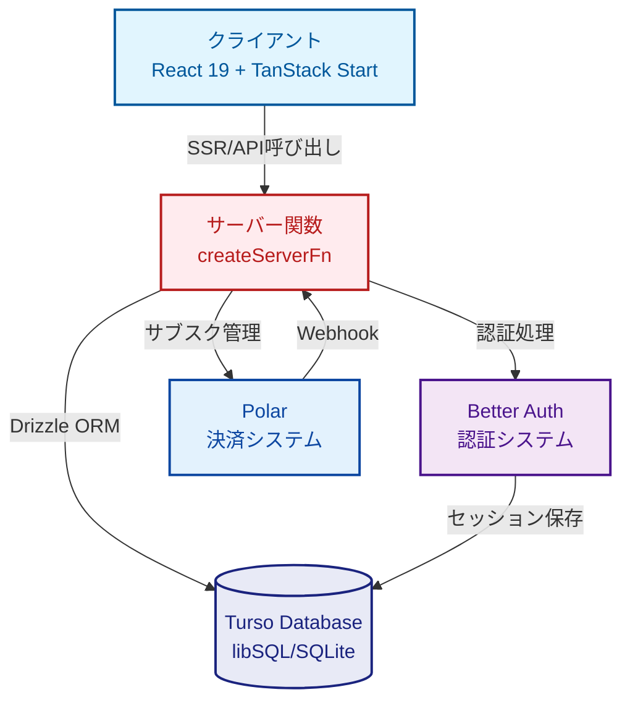
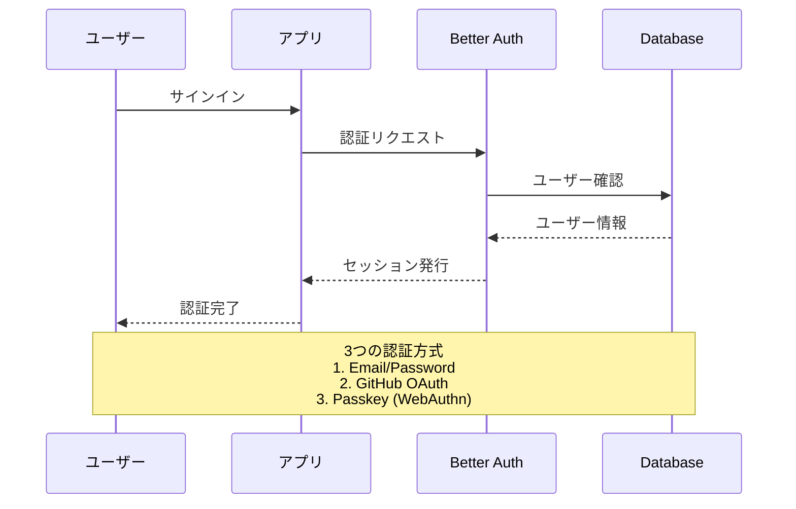
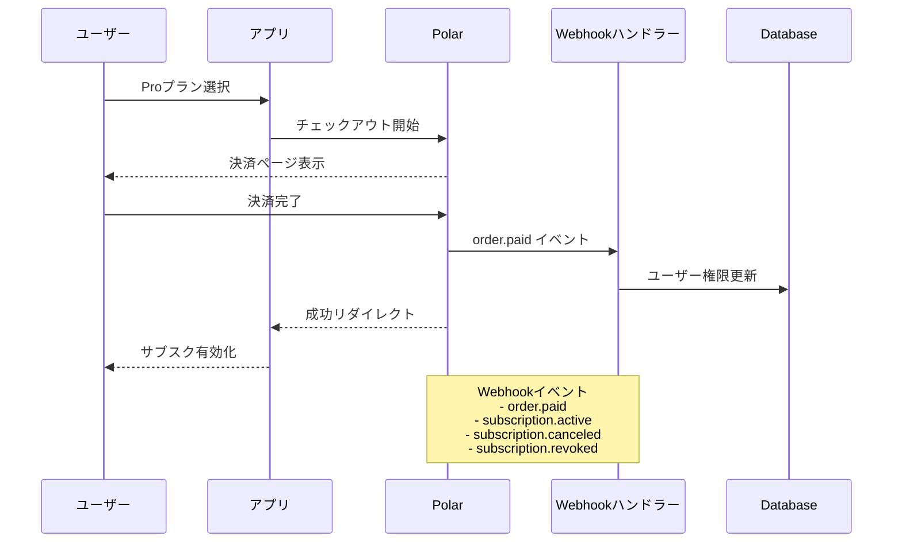
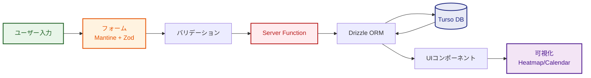
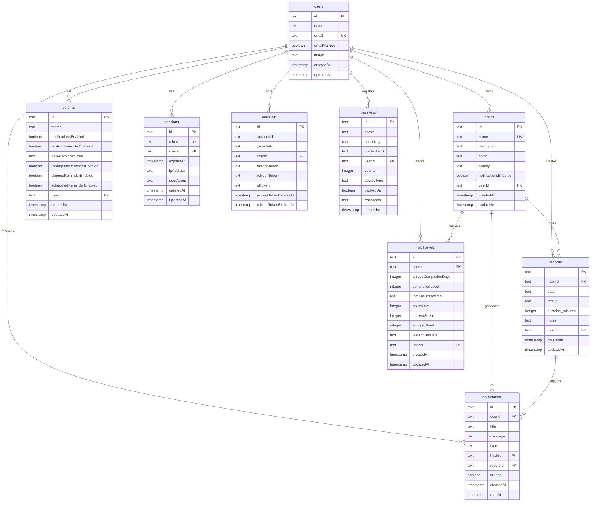

# 🎯 Track - 習慣トラッキングアプリケーション

> TanStack Startで構築されたモダンなフルスタック習慣追跡アプリケーション。リアルタイムデータ可視化、認証、サブスクリプション管理を実装。

[](https://www.typescriptlang.org/)
[](https://react.dev/)
[](https://tanstack.com/start)
[](https://workers.cloudflare.com/)

[🚀 ライブデモ](#) | [📖 ドキュメント](#主な機能) | [🐛 バグ報告](https://github.com/sc30gsw/tanstack-start-demo/issues)

---

## 📋 目次

- [プロジェクト概要](#プロジェクト概要)
- [主な機能](#主な機能)
- [技術スタック](#技術スタック)
- [システムアーキテクチャ](#システムアーキテクチャ)
- [データベース設計](#データベース設計)
- [セットアップ手順](#セットアップ手順)
- [開発ガイド](#開発ガイド)
- [デプロイメント](#デプロイメント)
- [技術的な学びと工夫](#技術的な学びと工夫)
- [ライセンス](#ライセンス)

---

## 🌟 プロジェクト概要

**Track**は、ユーザーが日々の習慣を構築・維持するための包括的な習慣追跡アプリケーションです。直感的な追跡、可視化、分析機能を通じて習慣形成をサポートします。モダンなWeb技術で構築され、SSR、リアルタイムデータ同期、認証、決済統合を含むフルスタック開発能力を実証しています。

### なぜこのプロジェクトを作ったのか？

このプロジェクトは以下を実証します：

- ✅ TanStack Start（SSRフレームワーク）を使用したモダンなReactパターン
- ✅ TypeScriptによる型安全なフルスタック開発
- ✅ Cloudflare Workers上のクラウドネイティブアーキテクチャ
- ✅ Better Auth（Passkeyサポート含む）による本番環境対応の認証
- ✅ Polar統合によるサブスクリプション管理
- ✅ Mantine Chartsによる高度なデータ可視化
- ✅ @dnd-kitによるドラッグ&ドロップUI実装
- ✅ Tiptapによるリッチテキストエディタ統合
- ✅ ゲーミフィケーション要素（レベル・バッジシステム）の実装
- ✅ Pomodoroタイマー・集中力ツールの開発
- ✅ 通知システムとリマインダー機能の構築

---

## ✨ 主な機能

### 🎨 コア機能

#### **習慣管理**
- カスタムカラーで習慣を作成、編集、削除
- 認証によるユーザー固有の習慣分離
- Turso (libSQL)による永続的なストレージ

#### **日次トラッキング**
- 時間追跡付きの習慣完了記録
- 各記録へのオプションメモ追加
- カレンダーベースの日付選択

#### **データ可視化**
- 📊 **ヒートマップビュー**: GitHubスタイルの継続グラフで習慣の一貫性を表示
- 📅 **カレンダービュー**: 月/週/日表示で完了状況を確認
- 📈 **統計ダッシュボード**: 総習慣数、記録数、日次完了率を追跡
- 🎯 **トレンドチャート**: 習慣のパフォーマンスを時系列で可視化

### 🔐 認証とユーザー管理

#### **Better Auth統合**
- メール/パスワード認証
- GitHubでのOAuthサインイン
- パスワードレスログイン用のPasskey（WebAuthn）サポート
- セキュアなセッション管理

### 💳 サブスクリプションと決済

#### **Polar統合**
- Proプランのチェックアウトフロー
- サブスクリプション管理用カスタマーポータル
- 決済イベントのWebhook処理（支払い完了、有効化、キャンセル、失効）
- サインアップ時の自動顧客作成

### 🔔 通知とリマインダー

#### **通知システム**
- 習慣実行リマインダー通知
- アクティブな習慣の通知管理
- カスタマイズ可能な通知設定
- プッシュ通知対応（ブラウザ通知）

### ⏱️ 集中力ツール

#### **フォーカス機能**
- **Pomodoroタイマー**: カスタマイズ可能な作業・休憩インターバル
- **ストップウォッチ**: 習慣実行時間の自由な計測
- **アンビエントサウンド**: 集中力向上のための環境音再生
- **セッション永続化**: タイマー状態の自動保存・復元

### 🏆 ゲーミフィケーション

#### **レベル＆バッジシステム**
- 習慣継続によるレベルアップ機能
- 実績バッジの獲得と収集
- 全体ユーザーレベルの計算
- 視覚的なレベル・バッジ表示
- 進捗状況の詳細な可視化

### 👤 ユーザー管理

#### **プロフィール機能**
- プロフィール情報の編集
- アカウント設定の管理
- プロフィール画像のカスタマイズ
- アカウント削除機能

### 📤 共有機能

#### **習慣データのエクスポート**
- 習慣データの共有機能
- クリップボードへのコピー
- カスタマイズ可能な共有フォーマット

### 🎨 UI/UX

- Mantine UIによるモダンでレスポンシブなデザイン
- 永続化されたダーク/ライトテーマ切り替え
- **ドラッグ&ドロップ**: 習慣の優先順位を直感的に変更
- **リッチテキストエディタ**: Tiptapによる高度なメモ入力
- **リサイズ可能パネル**: カスタマイズ可能なレイアウト
- **日本の祝日対応**: カレンダーに祝日を自動表示
- スムーズなアニメーションとトランジション
- モバイル最適化されたインターフェース

### 🌐 ランディングページ

#### **マーケティングサイト**
- プロフェッショナルなHeroセクション
- 機能紹介と使い方ガイド
- ユーザーの声・テスティモニアル
- 製品プレビュー（ダッシュボード、ヒートマップ）
- 価値提案の明確な提示
- CTAセクションによる導線設計

---

## 🛠 技術スタック

### フロントエンド

| 技術 | バージョン | 用途 |
|------|-----------|------|
| **TanStack Start** | ^1.131 | SSR対応Reactフレームワーク |
| **React** | ^19.0 | 最新のconcurrent機能を持つUIライブラリ |
| **TypeScript** | ^5.7 | 型安全な開発 |
| **Mantine UI** | ^8.3 | コンポーネントライブラリ |
| **Mantine Core** | ^8.3 | コアコンポーネント＆テーマシステム |
| **Mantine Charts** | ^8.3 | データ可視化（ヒートマップ、ラインチャート） |
| **Mantine Dates** | ^8.3 | カレンダー＆日付ピッカー |
| **Mantine Forms** | ^8.3 | フォーム状態管理 |
| **Mantine Modals** | ^8.3 | モーダル管理 |
| **Mantine Notifications** | ^8.3 | トースト通知 |
| **TailwindCSS** | ^4.0 | ユーティリティファーストCSS |
| **Tabler Icons** | ^3.35 | アイコンライブラリ |
| **@dnd-kit/core** | ^6.3 | ドラッグ&ドロップコア機能 |
| **@dnd-kit/sortable** | ^10.0 | ソート可能リスト実装 |
| **@dnd-kit/utilities** | ^3.2 | ドラッグ&ドロップユーティリティ |
| **Tiptap** | ^3.6 | リッチテキストエディタ |
| **react-resizable-panels** | ^3.0 | リサイズ可能パネル |
| **recharts** | ^3.2 | 追加チャート機能 |
| **dayjs** | ^1.11 | 日付操作ライブラリ |

### バックエンド＆データベース

| 技術 | バージョン | 用途 |
|------|-----------|------|
| **TanStack Router** | ^1.130 | 型安全なファイルベースルーティング |
| **Drizzle ORM** | ^0.44 | 型安全なデータベース操作 |
| **Turso** (libSQL) | ^0.15 | SQLite互換クラウドデータベース |
| **Zod** | ^4.1 | ランタイムスキーマ検証 |
| **nanoid** | ^5.1 | 軽量なユニークID生成 |
| **remeda** | ^2.32 | 型安全なユーティリティライブラリ |

### 認証＆決済

| 技術 | バージョン | 用途 |
|------|-----------|------|
| **Better Auth** | ^1.3 | 認証ソリューション |
| **Polar** | ^1.1 | サブスクリプション＆決済管理 |
| **Polar SDK** | ^0.35 | Polar API統合 |

### 開発＆ビルドツール

| 技術 | バージョン | 用途 |
|------|-----------|------|
| **Vite** | ^6.3 | ビルドツール＆開発サーバー |
| **Bun** | Latest | パッケージマネージャー＆ランタイム |
| **Biome** | ^2.2 | リント＆フォーマット |
| **Vitest** | ^3.0 | ユニットテストフレームワーク |
| **PostCSS** | ^8.5 | CSS処理（Mantineプリセット） |
| **lowlight** | ^3.3 | コードシンタックスハイライト |
| **@holiday-jp/holiday_jp** | ^2.5 | 日本の祝日データ |

### デプロイメント

| 技術 | 用途 |
|------|------|
| **Cloudflare Workers** | サーバーレスデプロイプラットフォーム |
| **Wrangler** | Cloudflare CLIツール |

---

## 🏗 システムアーキテクチャ

### システム構成図



### 認証フロー



### サブスクリプションフロー



### データフロー



---

## 📊 データベース設計

### ER図



### データベーススキーマ詳細

#### アプリケーションテーブル

**habits（習慣テーブル）**
- 習慣の定義とメタデータを保存
- ユーザーごとに分離（userId外部キー）
- カスタムカラー対応
- **priority**: 優先度管理（high/middle/low）
- **notificationsEnabled**: 習慣ごとの通知有効化

**records（記録テーブル）**
- 日次の習慣実行記録
- **status**: 実行状態（'active' | 'completed' | 'skipped'）
- 時間追跡とメモを含む
- 同一習慣・同一日付のユニーク制約

**notifications（通知テーブル）**
- アプリ内通知の管理
- 通知タイプ: `reminder`, `habit_scheduled`, `habit_active`, `habit_skipped`, `habit_incomplete`, `achievement`
- 既読/未読状態の追跡（isRead, readAt）
- 習慣・記録への関連付け
- **自動削除ポリシー**: タイプ別保持期間（リマインダー/習慣通知: 2日、実績: 30日）

**habitLevels（習慣レベルテーブル）**
- 習慣ごとのレベル進行システム
- **継続日数レベル**: uniqueCompletionDays（ユニーク完了日数）、completionLevel（レベル）
- **総時間レベル**: totalHoursDecimal（総時間）、hoursLevel（レベル）
- **ストリーク統計**: currentStreak（現在の連続記録）、longestStreak（最長連続記録）
- **アクティビティ追跡**: lastActivityDate（最終アクティビティ日）
- 習慣ごとに1レコード（habitId unique制約）

**settings（設定テーブル）**
- ユーザー設定とプリファレンス
- **テーマ設定**: light/dark/auto
- **通知設定**:
  - `notificationsEnabled`: 全体通知有効化
  - `customReminderEnabled`: カスタムリマインダー有効化
  - `dailyReminderTime`: 毎日のリマインダー時刻（HH:mm形式）
  - `incompleteReminderEnabled`: 未完了習慣通知
  - `skippedReminderEnabled`: スキップ習慣通知
  - `scheduledReminderEnabled`: 予定習慣通知

#### Better Auth テーブル

**users（ユーザーテーブル）**
- ユーザーアカウント情報
- メール検証ステータス

**sessions（セッションテーブル）**
- アクティブセッション管理
- IPアドレス、ユーザーエージェント記録

**accounts（アカウントテーブル）**
- OAuth連携アカウント情報
- アクセストークン、リフレッシュトークン管理

**verifications（検証テーブル）**
- メール検証コード管理

**passkeys（Passkeyテーブル）**
- WebAuthn認証情報
- デバイスタイプ、公開鍵を保存

---

## 📁 ディレクトリ構造

### プロジェクト構造

```
src/
├── routes/                    # TanStack Router ファイルベースルート
│   ├── __root.tsx            # ルートレイアウト（プロバイダー設定）
│   ├── index.tsx             # ホームページ（ダッシュボード）
│   ├── habits/               # 習慣管理ルート
│   │   ├── index.tsx         # 習慣一覧
│   │   └── $habitId.tsx      # 習慣詳細（動的ルート）
│   ├── auth/                 # 認証ルート
│   │   ├── sign-in.tsx       # サインインページ
│   │   ├── sign-up.tsx       # サインアップページ
│   │   ├── sign-out.tsx      # サインアウトハンドラー
│   │   └── passkey-setup.tsx # Passkey登録
│   ├── focus/                # 集中力ツールルート
│   │   └── index.tsx         # フォーカスタイマーページ
│   ├── settings/             # 設定ルート
│   │   ├── notifications.tsx # 通知設定
│   │   ├── profile.tsx       # プロフィール設定
│   │   ├── account.tsx       # アカウント設定
│   │   └── theme.tsx         # テーマ設定
│   ├── checkout/             # 決済ルート
│   │   ├── index.tsx         # チェックアウトページ
│   │   └── success.tsx       # 成功コールバック
│   ├── customer/             # カスタマールート
│   │   └── portal.tsx        # カスタマーポータル
│   └── api/                  # サーバーサイドAPIルート
│       └── auth/$.ts         # Better Authハンドラー
│
├── features/                 # 機能ベースモジュール
│   ├── habits/               # 習慣トラッキング機能
│   │   ├── components/       # 習慣固有UIコンポーネント
│   │   │   ├── form/        # フォームコンポーネント
│   │   │   ├── calendar/    # カレンダービュー
│   │   │   └── chart/       # チャート・可視化
│   │   ├── server/          # サーバー関数（CRUD操作）
│   │   ├── types/           # 型定義＆Zodスキーマ
│   │   ├── hooks/           # カスタムフック
│   │   ├── utils/           # ユーティリティ関数
│   │   └── constants/       # 定数（バッジ、レベル閾値等）
│   ├── auth/                # 認証機能
│   │   ├── components/      # 認証UI（Passkey、Portal）
│   │   └── server/          # 認証サーバー関数
│   ├── home/                # ホームダッシュボード機能
│   │   ├── components/      # ダッシュボードコンポーネント
│   │   │   ├── calendar/    # ホームカレンダービュー
│   │   │   └── chart/       # ホームチャート
│   │   ├── server/          # ホームサーバー関数
│   │   ├── utils/           # ホームユーティリティ
│   │   ├── types/           # ホーム型定義
│   │   └── constants/       # ホーム定数（レベル、バッジ）
│   ├── notifications/       # 通知機能
│   │   └── hooks/           # 通知フック
│   ├── profile/             # プロフィール管理
│   │   └── server/          # プロフィールサーバー関数
│   ├── settings/            # 設定管理
│   │   ├── components/      # 設定UIコンポーネント
│   │   └── server/          # 設定サーバー関数
│   ├── landing/             # ランディングページ
│   │   └── components/      # ランディングコンポーネント
│   │       └── previews/    # プレビューコンポーネント
│   ├── theme/               # テーマ管理
│   │   ├── components/      # テーマ切り替え
│   │   └── server/          # テーマ永続化
│   └── root/                # ルートレベル機能
│       ├── components/      # Pomodoro、ストップウォッチ等
│       ├── server/          # ルートサーバー関数
│       ├── utils/           # タイマー、通知ユーティリティ
│       └── types/           # ルート型定義
│
├── components/              # 共有コンポーネント
│   ├── ui/                  # 再利用可能UIコンポーネント
│   └── providers/           # コンテキストプロバイダー
│
├── db/                      # データベースレイヤー
│   ├── schema.ts            # Drizzleスキーマ定義
│   └── index.ts             # データベースクライアント
│
├── lib/                     # コアライブラリ
│   ├── auth.ts              # Better Auth設定
│   └── auth-client.ts       # 認証クライアントユーティリティ
│
└── theme/                   # Mantineテーマ設定
    └── index.ts             # テーマカスタマイズ
```

### 主要な設計パターン

1. **サーバー関数**: `createServerFn`による型安全なサーバーサイド操作
2. **Zodバリデーション**: すべてのユーザー入力とAPIレスポンスのランタイム検証
3. **ファイルベースルーティング**: TanStack Routerによる自動ルート生成
4. **機能ベース構成**: 関連するコンポーネント、フック、ロジックのコロケーション
5. **SSRデータローディング**: 最適なパフォーマンスのためのルートローダー

---

## 🚀 セットアップ手順

### 前提条件

- [Bun](https://bun.sh/)（最新バージョン）
- [Turso](https://turso.tech/)アカウント（データベース用）
- [Better Auth](https://www.better-auth.com/)セットアップ
- [Polar](https://polar.sh/)アカウント（決済用、オプション）
- GitHub OAuthアプリ（ソーシャルログイン用、オプション）

### 環境変数

プロジェクトルートに`.dev.vars`ファイルを作成：

```bash
# データベース（必須）
VITE_TURSO_CONNECTION_URL=your-turso-url
VITE_TURSO_AUTH_TOKEN=your-turso-token

# Better Auth（必須）
VITE_BETTER_AUTH_URL=http://localhost:3000
VITE_BETTER_AUTH_SECRET=your-secret-key

# GitHub OAuth（オプション）
VITE_GITHUB_CLIENT_ID=your-github-client-id
VITE_GITHUB_CLIENT_SECRET=your-github-client-secret

# Passkey設定（オプション）
VITE_PASSKEY_RP_ID=your-domain.com
VITE_PASSKEY_RP_NAME=Track

# Polar統合（オプション）
VITE_POLAR_ACCESS_TOKEN=your-polar-token
VITE_POLAR_SERVER=sandbox  # または production
VITE_POLAR_PRODUCT_ID=your-product-id
VITE_POLAR_WEBHOOK_SECRET=your-webhook-secret
```

### インストール

```bash
# 依存関係のインストール
bun install

# データベーススキーマの生成
bun run db:push

# 開発サーバーの起動
bun run dev
```

アプリケーションは`http://localhost:3000`で利用可能になります

---

## 💻 開発ガイド

### 利用可能なコマンド

```bash
# 開発
bun run dev              # ポート3000で開発サーバー起動
bun run cf:dev          # Cloudflareローカル開発サーバー起動

# ビルド＆本番
bun run build           # 本番用ビルド
bun run start           # 本番サーバー起動
bun run serve           # 本番ビルドプレビュー

# データベース
bun run db:generate     # マイグレーション生成
bun run db:migrate      # マイグレーション実行
bun run db:push         # スキーマ変更をプッシュ
bun run db:studio       # Drizzle Studio起動

# コード品質
bun run test            # Vitestテスト実行
bun run tsc             # TypeScript型チェック
bun run lint            # Biomeリント（自動修正）
bun run format          # Biomeコードフォーマット
bun run check           # Biome包括的チェック

# バックグラウンドジョブ
bun run cron:test       # Cronジョブテスト実行（通知生成）

# デプロイメント
bun run deploy          # Cloudflare Workersへデプロイ
bun run cf:build        # ビルド＆デプロイ
```

### 開発ワークフロー

#### 1. 機能の作成

```bash
# 機能ディレクトリの作成
mkdir -p src/features/your-feature/{components,server,types}
```

#### 2. ルートの追加

```bash
# ルートファイル追加（自動的にルート生成）
touch src/routes/your-route.tsx
```

#### 3. サーバー関数の実装

```typescript
// src/features/your-feature/server/functions.ts
import { createServerFn } from '@tanstack/react-start/server'
import { z } from 'zod'

export const yourFunction = createServerFn({ method: 'POST' })
  .validator((data: unknown) => yourSchema.parse(data))
  .handler(async ({ data }) => {
    // サーバーサイドロジック
    return { success: true }
  })
```

#### 4. 型安全なフォーム

```typescript
import { useForm, zodResolver } from '@mantine/form'
import { yourSchema } from './types/schemas'

const form = useForm({
  validate: zodResolver(yourSchema),
  initialValues: { /* ... */ }
})
```

---

## 🚢 デプロイメント

### Cloudflare Workers デプロイ

#### 1. Wranglerの設定

プロジェクトは`wrangler.json`で設定済み：

```json
{
  "name": "track-habit-app",
  "compatibility_date": "2025-09-27",
  "compatibility_flags": ["nodejs_compat"]
}
```

#### 2. 本番シークレットの設定

```bash
# データベース認証情報の設定
echo "your-turso-url" | bun wrangler secret put VITE_TURSO_CONNECTION_URL
echo "your-turso-token" | bun wrangler secret put VITE_TURSO_AUTH_TOKEN

# 認証シークレットの設定
echo "your-auth-url" | bun wrangler secret put VITE_BETTER_AUTH_URL
echo "your-auth-secret" | bun wrangler secret put VITE_BETTER_AUTH_SECRET

# その他の必要なシークレット...
```

#### 3. デプロイ

```bash
bun run cf:build    # ビルド＆デプロイ
# または
bun run deploy      # デプロイのみ
```

#### 4. デプロイの検証

- Cloudflare Workersダッシュボードで確認
- 認証フローのテスト
- データベース接続の確認
- Polar Webhook（設定している場合）のテスト

---

## 📚 技術的な学びと工夫

### 1. TanStack Startのマスタリー

- **ファイルベースルーティング**: 型安全なパラメータを持つ動的ルートの実装
- **サーバー関数**: 再利用可能で検証済みのサーバー操作の作成
- **SSR最適化**: 最適なデータフェッチのためのローダー活用
- **ストリーミング**: Suspenseによる段階的レンダリング

### 2. 認証アーキテクチャ

- **マルチプロバイダー認証**: Email/Password、OAuth（GitHub）、Passkeyの統合
- **セッション管理**: Better Authによる安全なセッション処理の実装
- **Passkey統合**: パスワードレス認証のためのWebAuthnサポート追加
- **ユーザー分離**: 適切なユーザー関係を持つデータベーススキーマ設計

### 3. 決済統合

- **Polarチェックアウト**: カスタム成功ハンドリングを伴うサブスクリプションフローの実装
- **Webhook管理**: 決済イベント（paid、active、canceled、revoked）の処理
- **カスタマーポータル**: セルフサービスサブスクリプション管理の統合
- **イベント駆動アーキテクチャ**: 非同期決済イベントの確実な処理

### 4. データベース設計

- **Drizzle ORM**: リレーションを持つ型安全なスキーマ設計
- **Turso (libSQL)**: SQLite互換クラウドデータベースの活用
- **データ整合性**: ユニーク制約とカスケード削除の実装
- **マイグレーション戦略**: Drizzle Kitによるスキーマバージョニング

### 5. データ可視化

- **Mantine Charts**: 習慣追跡用のヒートマップとラインチャートの構築
- **カレンダーコンポーネント**: カスタム月/週/日ビューの作成
- **日付ユーティリティ**: dayjsによる日本語ロケール実装
- **パフォーマンス**: 大規模データセットレンダリングの最適化

### 6. フルスタック型安全性

- **エンドツーエンド型**: クライアントとサーバー間での型共有
- **Zodバリデーション**: TypeScript型に一致するランタイム検証
- **フォームバリデーション**: Mantine FormとZodリゾルバーの統合
- **APIコントラクト**: 型安全なサーバー関数呼び出し

### 7. モダンUI/UX

- **Mantine UIシステム**: コンポーネントライブラリの効果的な活用
- **テーマ管理**: 永続的なテーマ切り替えの実装
- **レスポンシブデザイン**: デスクトップとモバイルの最適化
- **アクセシビリティ**: セマンティックHTMLとARIA属性の使用

### 8. ゲーミフィケーション実装

- **レベルシステム設計**: 習慣継続日数に基づく段階的レベル進行
- **バッジシステム**: 実績に基づく多様なバッジ取得ロジック
- **進捗可視化**: レベル・バッジの視覚的表現とアニメーション
- **モチベーション設計**: ユーザーエンゲージメントを高める仕組み

### 9. フォーカス機能とタイマー管理

- **Pomodoroタイマー**: カスタマイズ可能な作業・休憩サイクル
- **タイマー永続化**: LocalStorageによるセッション状態の保存・復元
- **アンビエントサウンド**: Web Audio APIを活用した環境音再生
- **通知統合**: タイマー完了時のブラウザ通知

### 10. 高度なUI実装

- **ドラッグ&ドロップ**: @dnd-kitによる直感的な優先順位変更
- **リッチテキストエディタ**: Tiptapによる拡張可能なメモ入力
- **リサイズ可能レイアウト**: react-resizable-panelsによる柔軟なUI
- **日本の祝日対応**: @holiday-jp統合によるカレンダー機能強化

### 11. バックグラウンドジョブと通知管理

- **Cronジョブシステム**: 定期的な通知生成バックグラウンドジョブ
- **時刻ベース通知**: デフォルト通知時刻（9:00, 13:00, 17:00, 21:00 JST）
- **習慣ステータス追跡**: active/completed/skipped状態に基づく自動通知生成
- **自動削除ポリシー**: タイプ別の通知保持期間管理（2日〜30日）
- **タイムゾーン対応**: dayjs timezone/utcプラグインによる正確な時刻管理

### 12. DevOps＆デプロイメント

- **Cloudflare Workers**: サーバーレスアプリケーションのグローバルデプロイ
- **環境管理**: ローカルと本番環境の設定
- **CI/CD準備**: 自動デプロイ用スクリプトのセットアップ
- **モニタリング**: エラーバウンダリとロギングの統合
- **Cronジョブ実行**: `bun run cron:test`によるテストモード実行

---

## 🎨 スクリーンショット

_アプリケーションがデプロイされたら、ここにスクリーンショットが追加されます_

### ダッシュボード


### 習慣管理


### ヒートマップ可視化


### カレンダービュー


---

## 📝 ライセンス

このプロジェクトはMITライセンスの下でライセンスされています - 詳細は[LICENSE](LICENSE)ファイルを参照してください。

---

## 👤 著者

**Your Name**

- GitHub: [@sc30gsw](https://github.com/sc30gsw)

---

## 🙏 謝辞

- [TanStack](https://tanstack.com/) - 素晴らしいReactエコシステム
- [Mantine](https://mantine.dev/) - 美しいUIコンポーネント
- [Better Auth](https://www.better-auth.com/) - セキュアな認証
- [Polar](https://polar.sh/) - 決済統合
- [Turso](https://turso.tech/) - エッジデータベース
- [Cloudflare](https://www.cloudflare.com/) - グローバルデプロイメント

---

## 🤝 コントリビューション

コントリビューション、イシュー、機能リクエストを歓迎します！

[イシューページ](https://github.com/sc30gsw/tanstack-start-demo/issues)をご確認ください。

---

<div align="center">
  TanStack Start、React、TypeScriptで🔥を込めて作成
</div>
